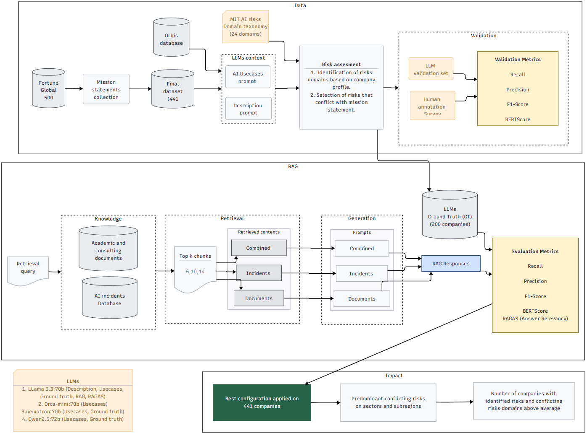

# Detecting conflicts between AI risks and company missions: A global analysis using LLM and RAG architecture

Artificial intelligence (AI) is now embedded in many organisations, driving progress while introducing complex risks. Following Slattery et al. (2024), AI risk is defined as “the possibility of an unfortunate occurrence associated with the development or deployment of AI”. Such risks may stem from training data, algorithms, or human interaction, and can cause harm to individuals, organisations, or society.

The NIST AI Risk Management Framework calls for governance that aligns AI systems with organisational values (NIST, 2023). However, practical methods for detecting conflicts between AI risks and these values remain limited. Mission statements, which articulate an organisation’s purpose, commitments, and guiding principles, provide a clear reference point for evaluating such conflicts. 

Recent advances in Retrieval Augmented Generation (RAG) enable large‑scale AI risk analysis (Rao et al., 2025). This dissertation applies RAG to the Fortune Global 500 to systematically identify AI risks, assess their conflict with stated missions, and reveal sector and geographic patterns.

📂 Repository Overview

This repository contains the code, datasets, and knowledge base used in the dissertation.
Notebooks are numbered in the order they should be executed, starting with exploratory analysis and ending with the impact analysis.

📊 Data Sources
1. Missions.xlsx
- List of companies from the 2024 Fortune Global 500.
- 441 mission statements collected via ChatGPT and manual validation.
- Original company list downloaded from the Fortune website.
2. Knowledge Base (used in the RAG pipeline)
- Documents: Academic articles (from Web of Science) and consulting reports (via web search).
Three documents per sector for each of the 21 sectors in the Fortune Global 500.
- AIID: AI Incidents Database from McGregor (2021).
Includes:
- Original download (21 July 2025)
- Incidents classified under the MIT Domain Taxonomy (Slattery et al., 2024)
Stored in the AI_incidents folder.

📒 **Notebooks**

| Notebook | Inputs | Outputs |
|----------|----------|-----------|
| 0_Exploratory_analysis | Missions.xlsx | incidents_mit.csv |
| 1_description_and_usecases | Missions.xlsx | 1_companies_df.csv |
| 2_Survey | Survey | 2_companies_survey.csv |
| 3_ground_truth_llm | 1_companies_df.csv,2_companies_survey.csv | llm_survey.csv, 3_llm_answers.csv |
| 4_RAG_and_evaluation | 3_llm_answers.csv | 4_fullset_RAG.csv |
| 5_Impact_analysis | 4_fullset_RAG.csv | — |

**Methodology workflow**

## 📚 References

- **McGregor, S.** (2021). *Preventing repeated real world AI failures by cataloging incidents: The AI incident database*. Proceedings of the AAAI Conference on Artificial Intelligence, **35**(17), 15458–15463.

- **NIST** (2023). *Artificial intelligence risk management framework (AI RMF 1.0)*.  
  URL: [https://nvlpubs.nist.gov/nistpubs/ai/NIST.AI.100-1.pdf](https://nvlpubs.nist.gov/nistpubs/ai/NIST.AI.100-1.pdf)

- **Rao, P. S. B., Šćepanović, S., Zhou, K., Bogucka, E. P., & Quercia, D.** (2025). *RiskRAG: A Data-Driven Solution for Improved AI Model Risk Reporting*. In *Proceedings of the 2025 CHI Conference on Human Factors in Computing Systems*. Association for Computing Machinery.

- **Slattery, P., Saeri, A. K., Grundy, E. A. C., Graham, J., Noetel, M., Uuk, R., Dao, J., Pour, S., Casper, S., & Thompson, N.** (2024). *The AI Risk Repository: A Comprehensive Meta-Review, Database, and Taxonomy of Risks From Artificial Intelligence*. *arXiv preprint* [arXiv:2408.12622](https://arxiv.org/abs/2408.12622).

